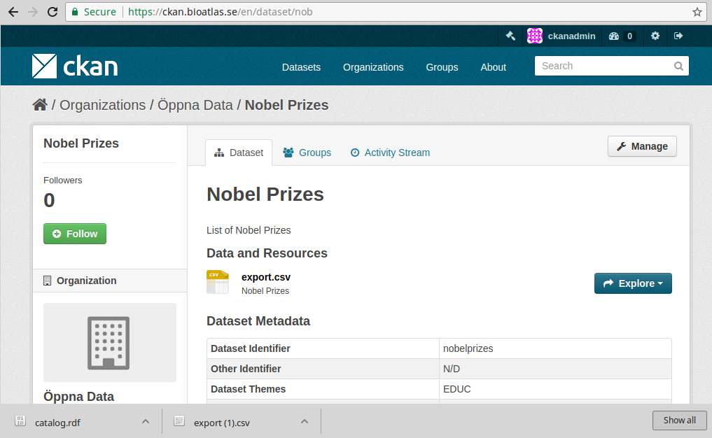

# Swedish DCAT-AP generator

_*UPDATE*_ please do not use the "editor" mentioned below - it is deprecated and doesn't work - see instead if this repo fits your use case: <https://github.com/riksantikvarieambetet/soch-dcat-ap>

This experimental project provides a minimal set of containers with tools that can be used to automate workflows involving DCAT-AP resources in Sweden (with the intent to publish on the Internet). 

A list with some of the relevant tools is available at <https://oppnadata.se/dcat-ap-metadataspecifikation/>, including for example:

- [x] CKAN <https://github.com/ckan/ckan>
- [ ] EntryScape <https://bitbucket.org/account/user/metasolutions/projects/ESC> 
- [ ] Datatank <https://github.com/tdt/> 
- [ ] GeoNetworks <https://github.com/geonetwork> 
- [ ] OpenDataSoft <https://github.com/opendatasoft>
- [ ] WikiMedia <https://github.com/Wikimedia-Sverige/DCAT>
- [ ] SEMICeu Validator <https://github.com/SEMICeu/dcat-ap_validator>

The project is work in progress - not all relevant tools are included yet - and a few tools are included which may later be removed as it is not clear whether they are actively maintained/supported or relevant for use within Sweden with the Swedish DCAT-AP v 1.1 standard. For example:

A tool from <https://github.com/project-open-data/catalog-generator> - a DCAT-AP generator which takes CSV input and generates a valid resource that can be exposed at a FQDN on the format `agency.gov/data`

This tool is listed as one of the reference implementations in this slightly dated DCAT-AP implementation guide from here:

<https://lists.w3.org/Archives/Public/public-dwbp-wg/2015Jul/att-0010/DCAT-APimplementationguide.pdf>

It also wraps and bundles a tool from <https://bitbucket.org/metasolutions/dcat-editor.git> - a DCAT-AP editor adapted for Sweden - created by Metasolutions. It is deprecated and will likely be removed from here or be replaced with a more up-to-date and supported alternative.

## Requirements

Install `git`, `make`, `docker` and `docker-compose`. Then, for name resolution to work, make your system aware of the `dnsmasq` name resolver that will be launched by docker and is defined in the `docker-compose.yml` file. 

On Linux this can be done by editing `/etc/resolvconf/resolv.conf.d/head`, adding this line:

		nameserver 172.17.0.1

Then restart `resolvconf` using this command:

		sudo systemctl restart resolvconf.service

For variations of how to do this on MacOS and other platforms, please search the Internet.

For setting up SSL, see instructions at <https://github.com/dina-web/proxy-docker/tree/self-signed-certs#certificates-and-setting-up-ssl>

## Usage

Issue the following command provided you have `make`, `git`, `docker` and `docker-compose`:

		make

## Adaptations for "generator"

If needed modify these files to adapt the field-to-term mappings etc:

		schema.yml
		_config.yml

## Adaptations for "editor"

This tool should be upgraded to support the next version of the schema.

## Usage of "ckan"

The `ckan` service is using <https://github.com/italia/dati-ckan-docker> which is the Italian setup of CKAN with plugins for DCAT and DCATAP-Italy. This CKAN configuration provides a `catalog.rdf` file which can be validated using for example `http://52.50.205.146:3031/dcat-ap_validator.html`

This service can be managed using these Makefile targets:

		# build everything from sources and launch services
		make

		# just start the ckan portal including redis, postgres, solr
		make up

		# initialize ckan (required on first run only)
		make init

		# launch ckan home (currently https://ckan.bioatlas.se)
		# NB: use firefox and login with `ckanadmin/ckanpassword`
		make browse

		# at this point, manually set up an Organization and add a Dataset
		make dl-demodata

		# get the catalog.rdf
		make dcatapit.rdf

		# validate dcatapit.rdf manually by uploading the file here
		firefox http://52.50.205.146:3031/dcat-ap_validator.html &

		# harvest
		make harvest

		# inspect logs
		docker-compose logs -f ckan

### Issues and TODO

- There is documentation available for extending the schema, see <https://github.com/italia/dati-ckan-docker/tree/master/ckan/ckanext-dcatapit#extending-the-package-schema-in-your-own-extension>.

- Plugins for geospatial support and multilang support can be added and Swedish language support could be added, it seems from documentation here: <https://github.com/italia/dati-ckan-docker/tree/master/ckan/ckanext-dcatapit#updating-an-existing-translation>

- The `https://ckan.bioatlas.se/catalog.rdf` file contains references to an internal name and port (http://localhost:5000) so the Makefile target `make dcatapit.rdf` replaces it with the public name instead using `sed`, but perhaps there is a configuration setting that should be used? Perhaps `ckanext.dcat.base_uri = YOUR_BASE_URI`?

- No success yet in harvesting when trying to harvest this URL <https://ckan.oppnadata.se/dataset/nobel-prizes> ... the process seems stuck.

## Links

- Crosswalk w field mappings versus Project Open Data, CKAN, Schema.org: <https://project-open-data.cio.gov/v1.1/metadata-resources/>

- Official CKAN docker getting started info: <http://docs.ckan.org/en/ckan-2.5.7/maintaining/installing/install-using-docker.html>

